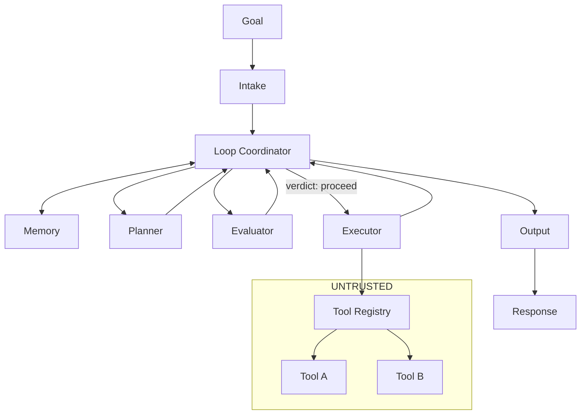

# Architecture Graph — Agent

Structural view. The dashed boundary is the untrusted side (D-002 / G4).

```mermaid
graph TD
  G[Goal] --> IN[Intake]
  IN --> LC[Loop Coordinator]
  LC <--> MEM[Memory]
  LC --> PL[Planner]
  PL --> LC
  LC --> EV[Evaluator]
  EV --> LC
  LC -->|verdict: proceed| EX[Executor]
  EX --> TR[Tool Registry]
  subgraph UNTRUSTED
    TR --> T1[Tool A]
    TR --> T2[Tool B]
  end
  EX --> LC
  LC --> OUT[Output]
  OUT --> R[Response]
```
