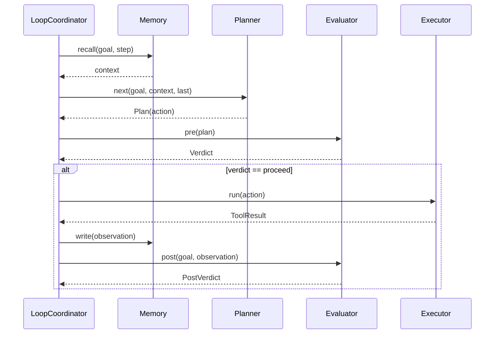

# Execution Map — Agent

Control view: one loop step. The Coordinator owns control; the Planner never
calls the Executor directly (forbidden dependency — see Dependencies.md).

```mermaid
sequenceDiagram
  participant LC as LoopCoordinator
  participant MEM as Memory
  participant PL as Planner
  participant EV as Evaluator
  participant EX as Executor
  LC->>MEM: recall(goal, step)
  MEM-->>LC: context
  LC->>PL: next(goal, context, last)
  PL-->>LC: Plan(action)
  LC->>EV: pre(plan)
  EV-->>LC: Verdict
  alt verdict == proceed
    LC->>EX: run(action)
    EX-->>LC: ToolResult
    LC->>MEM: write(observation)
    LC->>EV: post(goal, observation)
    EV-->>LC: PostVerdict
  end
```
