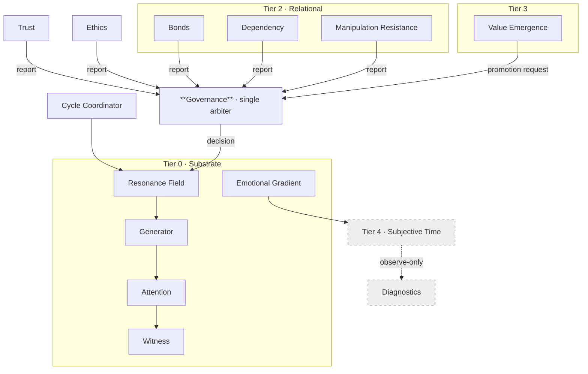

# Architecture Graph — Cognitive Cycle

Tiers feed reports upward; only Governance decides; time/diagnostics are
one-way terminal sinks.

```mermaid
graph TD
  COORD[Cycle Coordinator] --> SUB
  subgraph T0[Tier 0 · Substrate]
    SUB[Resonance Field] --> GEN[Generator] --> ATT[Attention]
    ATT --> WIT[Witness]
    EMO[Emotional Gradient]
  end
  subgraph T2[Tier 2 · Relational]
    BOND[Bonds]; DEP[Dependency]; RES[Manipulation Resistance]
  end
  subgraph T3[Tier 3]
    VAL[Value Emergence]
  end
  TRUST[Trust]; ETH[Ethics]
  TRUST -- report --> GOV
  ETH -- report --> GOV
  BOND -- report --> GOV
  DEP -- report --> GOV
  RES -- report --> GOV
  VAL -- promotion request --> GOV
  GOV[**Governance** · single arbiter] -- decision --> SUB
  EMO --> TIME
  TIME[Tier 4 · Subjective Time]:::sink -. observe-only .-> DIAG[Diagnostics]:::sink
  classDef sink fill:#eee,stroke:#999,stroke-dasharray:5 5;
```
