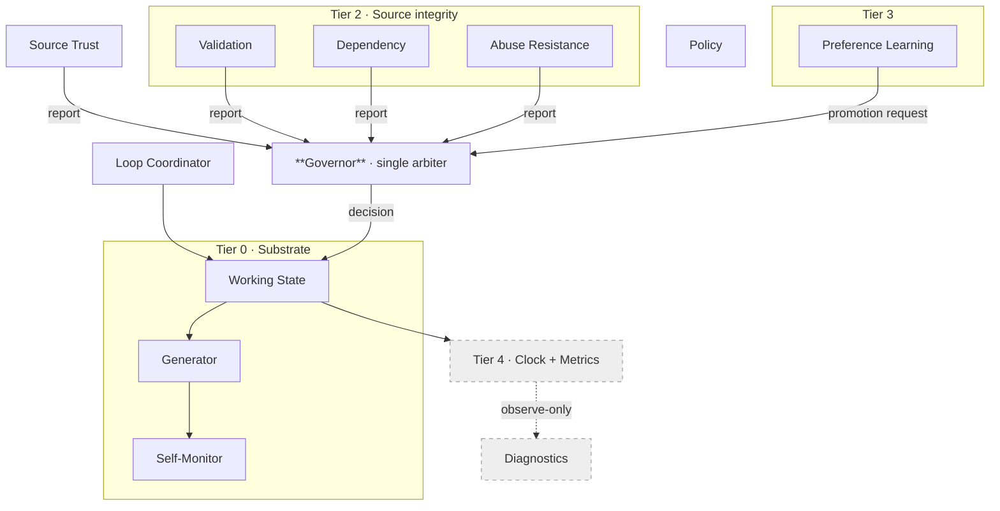

# Architecture Graph — Autonomous Cognitive Loop

Tiers feed reports upward; only the Governor decides; clock/metrics are one-way
terminal sinks.

```mermaid
graph TD
  COORD[Loop Coordinator] --> ST
  subgraph T0[Tier 0 · Substrate]
    ST[Working State] --> GEN[Generator] --> MON[Self-Monitor]
  end
  subgraph T2[Tier 2 · Source integrity]
    VAL[Validation]; DEP[Dependency]; ABU[Abuse Resistance]
  end
  subgraph T3[Tier 3]
    PREF[Preference Learning]
  end
  TRUST[Source Trust]; POL[Policy]
  TRUST -- report --> GOV
  VAL -- report --> GOV
  DEP -- report --> GOV
  ABU -- report --> GOV
  PREF -- promotion request --> GOV
  GOV[**Governor** · single arbiter] -- decision --> ST
  ST --> CLK
  CLK[Tier 4 · Clock + Metrics]:::sink -. observe-only .-> DIAG[Diagnostics]:::sink
  classDef sink fill:#eee,stroke:#999,stroke-dasharray:5 5;
```
