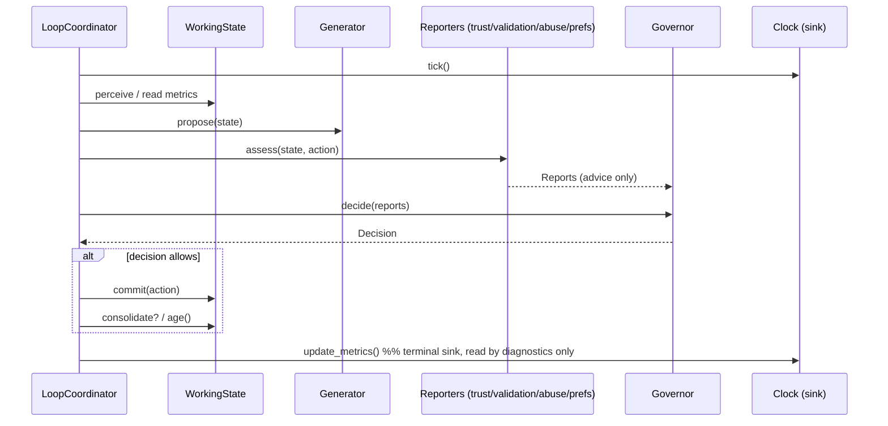

# Execution Map — Autonomous Cognitive Loop

Control view of one cycle. Reporters advise in parallel; the Governor alone rules.

```mermaid
sequenceDiagram
  participant C as LoopCoordinator
  participant S as WorkingState
  participant G as Generator
  participant R as Reporters (trust/validation/abuse/prefs)
  participant GOV as Governor
  participant T as Clock (sink)
  C->>T: tick()
  C->>S: perceive / read metrics
  C->>G: propose(state)
  C->>R: assess(state, action)
  R-->>GOV: Reports (advice only)
  C->>GOV: decide(reports)
  GOV-->>C: Decision
  alt decision allows
    C->>S: commit(action)
    C->>S: consolidate? / age()
  end
  C->>T: update_metrics()  %% terminal sink, read by diagnostics only
```
