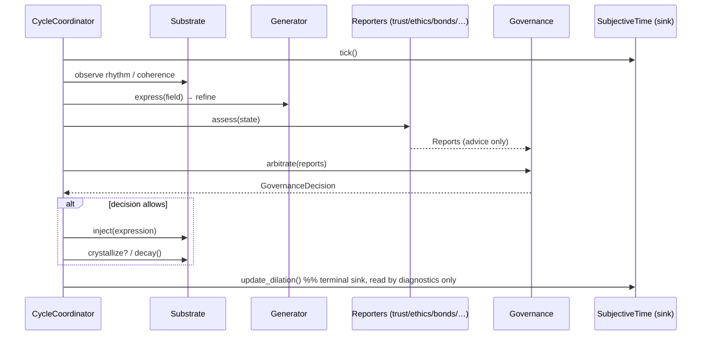

# Execution Map — Cognitive Cycle

Control view of one cycle. Reporters advise in parallel; Governance alone rules.

```mermaid
sequenceDiagram
  participant C as CycleCoordinator
  participant S as Substrate
  participant G as Generator
  participant R as Reporters (trust/ethics/bonds/…)
  participant GOV as Governance
  participant T as SubjectiveTime (sink)
  C->>T: tick()
  C->>S: observe rhythm / coherence
  C->>G: express(field) → refine
  C->>R: assess(state)
  R-->>GOV: Reports (advice only)
  C->>GOV: arbitrate(reports)
  GOV-->>C: GovernanceDecision
  alt decision allows
    C->>S: inject(expression)
    C->>S: crystallize? / decay()
  end
  C->>T: update_dilation()  %% terminal sink, read by diagnostics only
```
