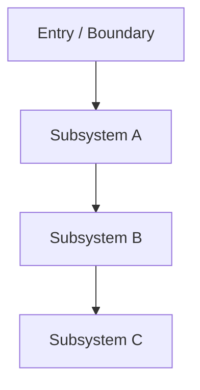

# Architecture Graph (template)

> Structural view: subsystems as nodes, boundaries as groupings.
> Replace with your system. ASCII or Mermaid both fine.

```mermaid
graph TD
  A[Entry / Boundary] --> B[Subsystem A]
  B --> C[Subsystem B]
  C --> D[Subsystem C]
```
