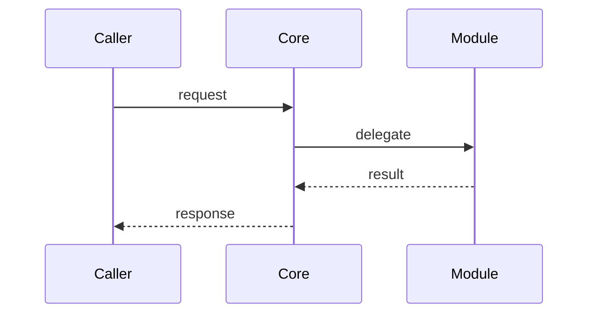

# Execution Map (template)

> Control view: who calls whom, where control originates and returns.

```mermaid
sequenceDiagram
  participant Caller
  participant Core
  participant Module
  Caller->>Core: request
  Core->>Module: delegate
  Module-->>Core: result
  Core-->>Caller: response
```
